<h1 align="center">hey-clawd</h1>

<p align="center"><a href="README.md">English</a> · <a href="README.zh-CN.md">简体中文</a></p>

<p align="center">
  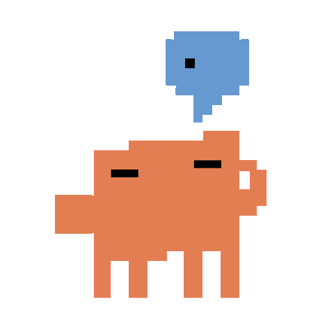
  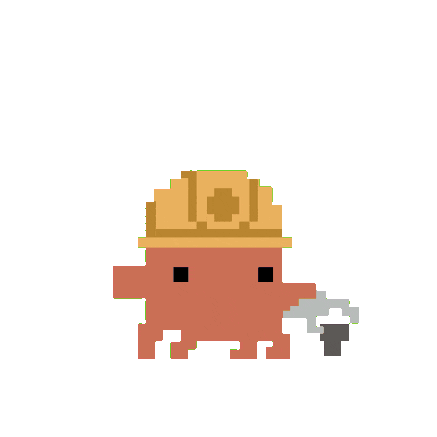
  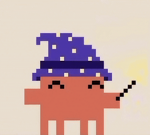
  
  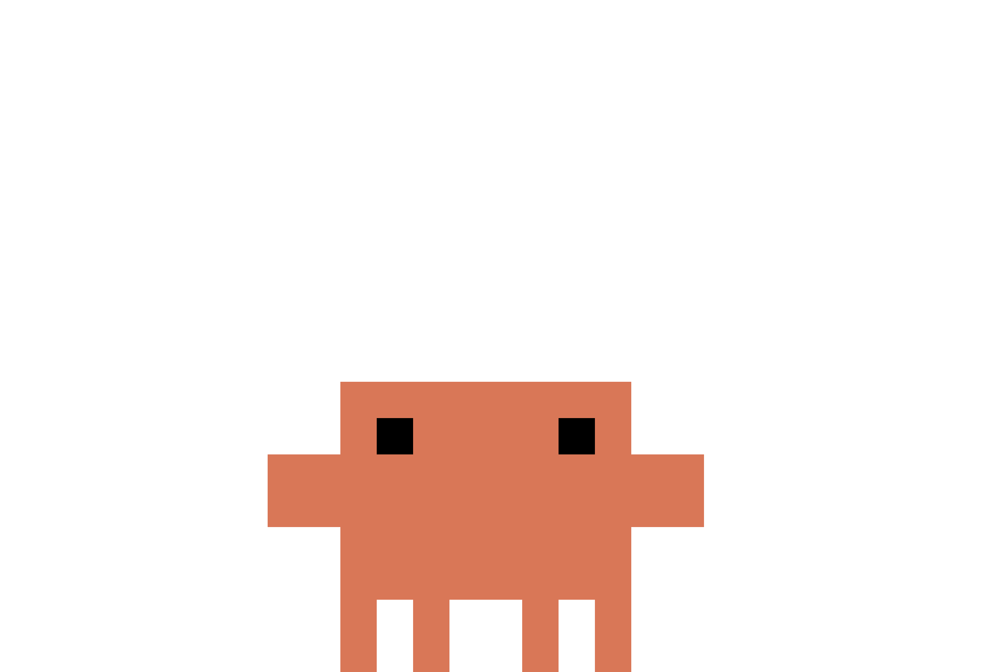
</p>

一只会响应 AI 编程会话的 macOS 菜单栏桌宠 —— Clawd 实时感知 Claude Code、Codex CLI、Cursor、Gemini CLI、GitHub Copilot CLI、CodeBuddy、Pi 的工具调用，根据空闲 / 思考 / 工作 / 错误 / 睡眠等状态播放不同动画。对 Claude Code 和 CodeBuddy 还额外提供浮动权限气泡，不必切回终端就能批准/拒绝工具调用。

## 亮点

- **联动 7 种 AI 编码工具** —— Claude Code、CodeBuddy、Cursor、Gemini CLI、Copilot CLI 走 hook；Pi 走 extension；Codex CLI 走 JSONL 日志监控。
- **权限气泡** —— 不切走编辑器也能批准/拒绝 Claude Code / CodeBuddy 的工具调用；`TaskCreate`、`TaskUpdate` 等 passthrough 工具自动放行。
- **自研 Core Animation SVG 管线** —— 不走 WebView，手绘 50+ 状态基于 15×16 像素网格，按需加载并带 LRU 缓存。
- **轻量原生实现** —— Swift 6 + AppKit/Core Animation，无 WebView、无内嵌 JS 运行时，CPU 和内存占用低。
- **纯菜单栏应用**（`LSUIElement`），配靠边 Mini 模式、跟随鼠标的眼神追踪、勿扰开关。
- **Sparkle 自动更新**（EdDSA 签名 appcast）。
- **仅一个外部依赖**：Sparkle，其它都是 Swift 6 + 标准库。

## 环境要求

- macOS 12（Monterey）或更新
- Node.js（供首次启动时将 hook / extension 注册进 Claude Code / Cursor / Gemini / CodeBuddy / Pi）

## 安装

### 下载 release

从 [GitHub Releases](https://github.com/BlueOcean223/hey-clawd/releases) 下载最新 `.dmg`，把 **hey-clawd.app** 拖进 `/Applications` 后启动。应用只住在菜单栏——右击clawd图标打开托盘菜单。

如果 macOS Gatekeeper 阻止启动，先尝试 **右键 → 打开** 一次；如果出现 **“应用已损坏”**、**“无法验证开发者”**，或者应用就是打不开，可以手动移除隔离属性：

```bash
xattr -dr com.apple.quarantine /Applications/hey-clawd.app
```

然后再重新启动应用。

首次启动会在 `127.0.0.1:23333` 开一个本地 HTTP 服务（端口冲突时回退到 23334–23337），并执行内置的 installer 脚本，把 hook / extension 注册到检测到的 AI 工具里。未安装的工具会被跳过。托盘菜单 → **Register Hooks** 可以随时重跑注册（比如 `cc-switch` 切换 profile 之后）。

### 从源码构建

```bash
# Swift Package Manager（debug）
swift build
.build/debug/hey-clawd

# Release 构建
swift build -c release

# Xcode（与 CI 一致）
xcodebuild -project hey-clawd.xcodeproj -scheme hey-clawd -configuration Release archive
```

## 支持的集成

| 工具 | 方式 | 数据方向 | 权限气泡 | 终端跳转 |
|------|------|---------|:-------:|:-------:|
| Claude Code  | hook           | 双向   | ✅ | ✅ |
| CodeBuddy    | hook           | 双向   | ✅ | ✅ |
| Gemini CLI   | hook           | 单向   | — | ✅ |
| Cursor       | hook           | 单向   | — | ✅ |
| Copilot CLI  | hook           | 单向   | — | ✅ |
| Codex CLI    | JSONL 监控     | 只读   | — | — |
| Pi           | extension      | 单向   | — | ✅ |

完整的事件覆盖矩阵见 [docs/integrations/platform-comparison.md](docs/integrations/platform-comparison.md)，各工具的接入细节在 [docs/integrations/](docs/integrations/)。

## 工作原理

```
IDE hooks / Pi extension / CodexMonitor  →  HTTP POST /state       →  HTTPServer  →  StateMachine  →  PetView (Core Animation)
IDE hooks                                →  HTTP POST /permission  →  HTTPServer  →  BubbleStack   →  allow/deny
```

- **StateMachine** —— 跨并发会话的优先级聚合器（0–8 级），高优先级状态覆盖低优先级；attention、error、notification 等一次性状态播完回落。
- **SVG 管线** —— `SVGParser` → `SVGDocument`（LRU 缓存）→ `CALayerRenderer` → `CAAnimationBuilder`（CSS keyframes → Core Animation）。深入讲解见 [docs/rendering-system.md](docs/rendering-system.md)。
- **集成桥接层**（`hooks/`）—— 包含 CommonJS hook 脚本 `clawd-hook.js`、`cursor-hook.js`、`gemini-hook.js`、`codebuddy-hook.js`、`copilot-hook.js`，Codex 的 JSONL 监控器 `codex-remote-monitor.js`，以及 Pi 的 extension / installer（`pi-extension.ts`、`pi-install.js`）。这些集成最终都会把工具生命周期事件映射为桌宠状态并 POST 到本地 HTTP。端口发现顺序：先 `~/.clawd/runtime.json`，再扫 23333–23337。
- **HTTP 端点** —— `/state`、`/permission`、`/status`、`/quit`，开发期还有 `/debug/svg` 和 `/debug/reset`。

## 状态画廊

几个代表性 SVG 状态预览。这些是带 CSS 动画的矢量图，运行时由 Core Animation 管线原生渲染——GitHub 上看到的和 app 里消费的是同一份源文件。

| Idle | Typing | Thinking | Wizard | Happy |
|:---:|:---:|:---:|:---:|:---:|
|  |  |  |  |  |
| `idle-living` | `working-typing` | `working-thinking` | `working-wizard` | `happy` |

| Smoking | Reading | Music | Dozing | Sleeping |
|:---:|:---:|:---:|:---:|:---:|
|  |  |  |  |  |
| `idle-smoking` | `idle-reading` | `idle-music` | `idle-doze` | `sleeping` |

完整 50+ 状态目录见 [docs/svg-catalog.md](docs/svg-catalog.md)。

## 开发

```bash
# Swift 测试（SVG 解析/渲染、HTTP 服务、Codex 监控、状态机）
swift test

# 权限气泡集成测试（对着运行中的 app）
./test-bubble.sh all         # 或: single | stack | passthrough | disconnect | dnd

# SVG 动画视觉冒烟测试（打 /debug/svg）
./test-animations.sh

# Hook 侧 Node 测试
cd hooks && node test/pi-install.test.js && node test/codex-remote-monitor.test.js && node test/hook-cleanup.test.js
```

更多文档：

- [docs/svg-catalog.md](docs/svg-catalog.md) —— 每个 `PetState` 对应的 SVG。
- [docs/svg-animation-spec.md](docs/svg-animation-spec.md) —— SVG 动画、像素网格与调色板规范。


## 许可

[MIT](LICENSE) —— 沿用 clawd-on-desk 的原作者署名。

## 鸣谢

- 本项目的形态、架构等承袭自 [@rullerzhou-afk](https://github.com/rullerzhou-afk) 的 [clawd-on-desk](https://github.com/rullerzhou-afk/clawd-on-desk)。
- 部分美术风格、场景气质与动画灵感也参考了 [@marciogranzotto](https://github.com/marciogranzotto) 的 [clawd-tank](https://github.com/marciogranzotto/clawd-tank)，感谢其提供的 Clawd 视觉设定与像素动画灵感。
- 该项目分享在 [LINUX DO](https://linux.do/) 社区中

